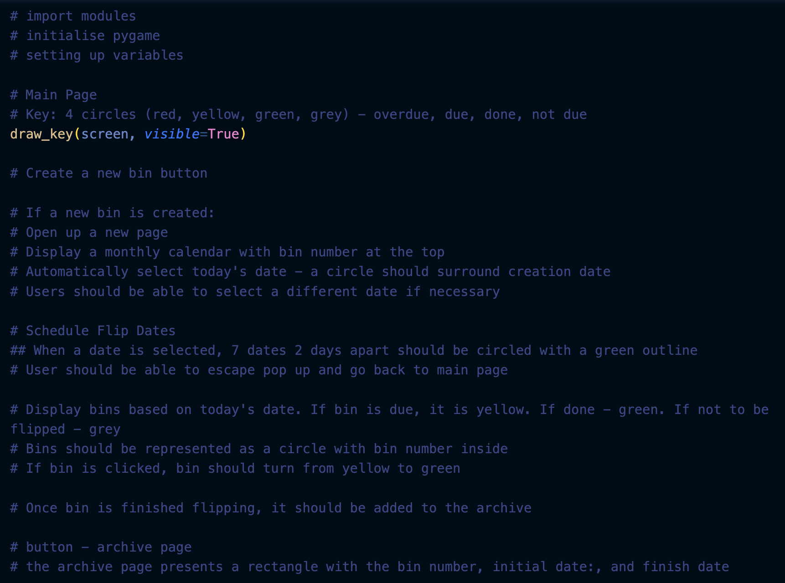

# Developer Notes

Description: This document is a record of regular (weekly) uodates to my prroject. It will describes the current task I am doing, any challenges I am facing, and upcoming goals/steps to do.

### Term 1 Week 11
Monday 08 April
- Received unofficial MW assessment notification
- Started putting together this documentation (Part B)

### Term 2 Week 3
Monday 13 May
- Worked on part B documentation:
- Created python files for modules (schedule, tracker, display, archive) and main file
- Started working on "Legal, Social and Ethical Considerations"
- TODO: Legal, Social and Ethical Considerations

Wednesday 15 May
- Worked on part B documentation:
- Completed "Legal, Social and Ethical Considerations"

Thursday 16 May
- Worked on part B documentation:
- Completed "Project Management"
- Started working on "Schedule Module"

### Term 2 Week 4
- Worked on part B documentation - collaborative approach

### Term 2 Week 5
Thursday 30 2024
- Worked on part B documentation - user interface design, evaluation
- Worked on code - used chat gpt to help with creating schedule and tracking functions
   
### Term 2 Week 6
- Worked on archive function
- TODO: check if track and archive functions work. create a list of predetermined dates as input
- TODO: need to create pygame user interface

### Term 2 Week 7
Thursday 13 June 
- Worked on pygame interface
- reflected on design and started coding a new interface

Friday 14 June
- Continued working on user interface 
- Implemented a key on main page
- Displayed the bins on main page after creating 
- TODO: display function to change the colour of the bins depending on today's date and the date bin needs to be flipped
- TODO: archive function that saves past bins to a folder?

### Term 3 Week 8
Monday 17 June
- Updated README.md file
 
Wednesday 19 June
- Asked for feedback and help from my Dad:
    -  He told me to write the full code in english pseudocode and fill it out with what I had
    - The layout of code was messy and hard to read
- Wrote an outline for pseudocode for user interface: 

Thursday 20 June
- Worked on pygame user interface
